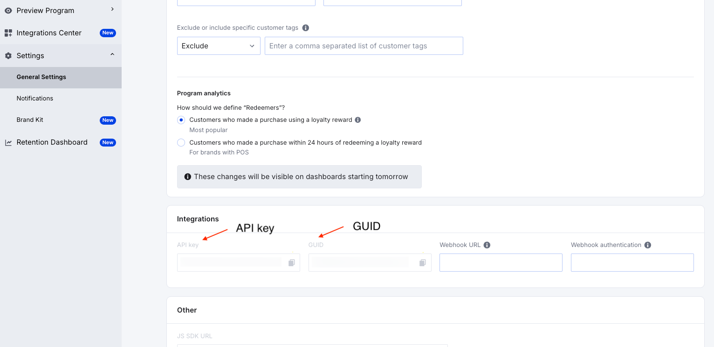
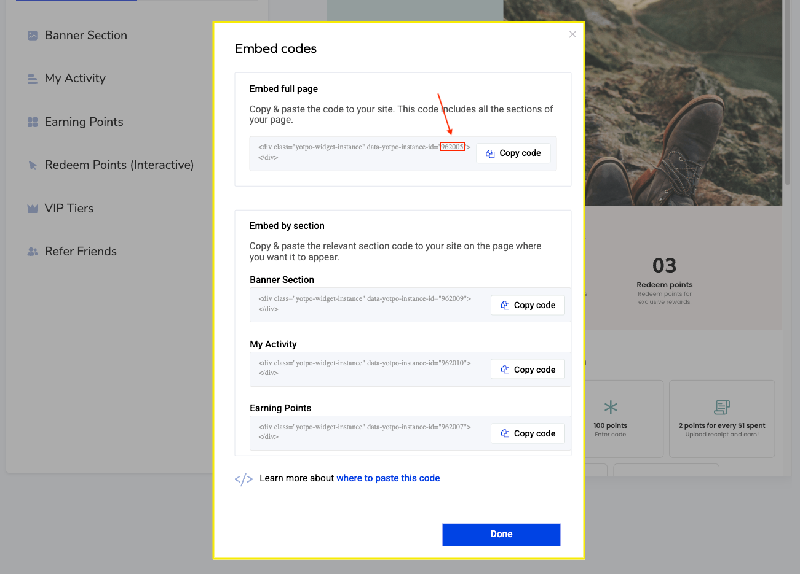

# Shopgate Connect - Yotpo Rewards

This extension integrates a Shopgate app with the [Yotpo Rewards](https://www.yotpo.com/platform/loyalty). Yotpo is a loyalty provider that rewards the user with points for discounts and free items.

## Configuration
Set the following values in your Shopgate Connect Admin:

### Required
- `guid` - (string) Needed to load the Yotpo Rewards Page inside the frontend. It can be retrieved from *Integrations => GUID* on the [General Settings](https://loyalty-app.yotpo.com/settings) page - [see screenshot](#api-key-and-guid).
- `apiKey` - (string) Needed to create a token in the backend to identify logged in users at Yotpo. It can be retrieved from *Integrations => API Key* on the [General Settings](https://loyalty-app.yotpo.com/settings) page - [see screenshot](#rewards-page-instance-id).
- `rewardsPageInstanceId` (string) - Needed to identify the correct Yotpo Rewards Page to be shown. Goto the [Rewards Page Builder](https://loyalty-app.yotpo.com/rewards-page-builder-widget), select the page you want to be used by the extension, click the **</>** icon and copy **only** the number from `data-yotpo-instance-id="1059421"` inside the "Embed full page" section.

### Optional
- `rewardsPageTitle` (string) Title for the Rewards Page (default: "Rewards")
- `tabBarIconLabel` (string) Label for the tab bar icon that opens the Rewards Page (default: "Rewards")
- `tabBarIconSvg` (string) SVG markup to replace the default tab bar icon e.g. `<path XYZ...>`

#### API Key and GUID

#### Rewards Page Instance Id

